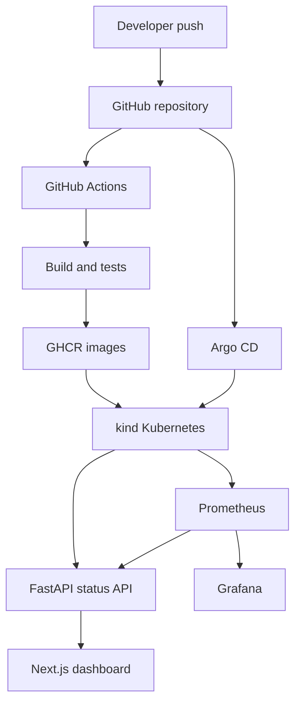

<p align="center">
  
</p>

<h1 align="center">Azure GitOps Deployment Dashboard</h1>

<p align="center">
  A full-stack, read-only operations dashboard for observing GitHub Actions releases,<br />
  Argo CD application state, Kubernetes workloads, and Prometheus metrics from one interface.
</p>

<p align="center">
  <a href="https://github.com/Chirag-Deviputra/Azure-Gitops-Deployment-Dashboard/actions/workflows/frontend-ci.yml"></a>
  <a href="https://github.com/Chirag-Deviputra/Azure-Gitops-Deployment-Dashboard/actions/workflows/backend-ci.yml"></a>
  
  
  
  
</p>

## Contents

- [Overview](#overview)
- [Features](#features)
- [Architecture](#architecture)
- [Project screenshots](#project-screenshots)
- [Technology stack](#technology-stack)
- [Application data](#application-data)
- [Local setup](#local-setup)
- [Monitoring installation](#monitoring-installation)
- [Development and validation](#development-and-validation)
- [CI/CD workflows](#cicd-workflows)
- [Security model](#security-model)
- [Troubleshooting](#troubleshooting)
- [Current status](#current-status)
- [Roadmap](#roadmap)

## Overview

Azure GitOps Deployment Dashboard demonstrates an end-to-end container delivery and observability workflow. GitHub Actions tests the Next.js frontend and FastAPI backend, builds Docker images, and publishes them to GitHub Container Registry (GHCR). Argo CD compares the Helm configuration in Git with the Kubernetes cluster and deploys the requested version after synchronization.

The dashboard reads the live Argo CD Application and Kubernetes workload APIs through a restricted service account. It reports health, synchronization state, Git revision, deployment history, replica readiness, pod state, restart counts, desired images, and runtime image IDs. Prometheus supplies CPU, memory, request rate, p95 latency, and server-error measurements, while Grafana provides detailed time-series dashboards.

The current deployment target is a local `kind` cluster running on Docker Desktop. The project is structured so that AKS and other managed Kubernetes environments can be added later.

## Features

- Separate GitHub Actions workflows for frontend and backend testing, builds, and GHCR publishing.
- Docker images published with both `dev` and full Git commit SHA tags.
- Kubernetes resources packaged as a reusable Helm chart.
- Argo CD health, sync status, revision, and successful deployment history.
- Live frontend and backend replica, pod readiness, termination, and restart information.
- Desired container tags and runtime image digest visibility.
- FastAPI Prometheus instrumentation for request count, duration, and HTTP 5xx errors.
- CPU and memory measurements for frontend and backend containers.
- Grafana Kubernetes resource dashboards.
- Read-only RBAC access for application and workload inspection.
- Health and readiness probes for safe Kubernetes rollouts.
- Windows launcher for starting the local environment and application port-forwards.

## Architecture



### Delivery flow

1. A developer pushes frontend, backend, or infrastructure changes to `main`.
2. The matching GitHub Actions workflow installs dependencies and runs its validation.
3. Docker Buildx builds the application image.
4. The workflow publishes `dev` and commit-SHA tags to GHCR.
5. Argo CD compares `helm/gitops-dashboard` with the live `gitops-dev` namespace.
6. The operator refreshes and synchronizes the Argo CD Application.
7. Kubernetes rolls out the workload and evaluates readiness and liveness probes.
8. The dashboard reads current application and workload status.
9. Prometheus scrapes backend HTTP metrics and Kubernetes resource metrics.
10. The Metrics screen and Grafana display the collected measurements.

> Argo CD synchronization is intentionally manual in the current version. Automated synchronization, pruning, and self-healing are planned improvements.

## Project screenshots

### Argo CD application topology

The Argo CD Application is Healthy and Synced. Its resource tree shows the frontend deployment, backend ServiceMonitor, RBAC objects, ReplicaSets, and pods managed from the Helm chart.


### Live deployment overview

The application dashboard reads live Argo CD and Kubernetes data, including application state, Git revision, namespace, desired replicas, active pods, readiness, restarts, and deployed images.


### Prometheus and Grafana monitoring

Grafana visualizes Kubernetes CPU and memory measurements for the frontend and backend workloads in the `gitops-dev` namespace.


## Technology stack

| Area | Technology | Purpose |
|---|---|---|
| Frontend | Next.js, React, TypeScript | Responsive operations dashboard |
| Backend | FastAPI, Python, HTTPX | Read-only status and monitoring API |
| CI | GitHub Actions | Automated tests, builds, and image publishing |
| Containers | Docker, Docker Buildx | Reproducible frontend and backend images |
| Registry | GitHub Container Registry | Stores `dev` and commit-SHA image tags |
| Orchestration | Kubernetes with kind | Runs the local application environment |
| Packaging | Helm | Templates Deployments, Services, RBAC, and ServiceMonitor |
| GitOps | Argo CD | Compares Git configuration with cluster state |
| Metrics | Prometheus, kube-state-metrics, node-exporter | Collects application and cluster measurements |
| Visualization | Grafana | Displays Kubernetes resource time series |
| Local platform | Docker Desktop | Hosts the kind control-plane container |

## Repository structure

```text
.
├── .github/workflows/
│   ├── frontend-ci.yml          # Frontend build and GHCR publishing
│   └── backend-ci.yml           # Backend tests, build and GHCR publishing
├── app/
│   ├── api/                     # Server-side backend proxy routes
│   ├── metrics-panel.tsx        # Prometheus metrics presentation
│   └── page.tsx                 # Main operations dashboard
├── backend/
│   ├── app/
│   │   ├── main.py              # FastAPI application and Kubernetes queries
│   │   └── monitoring.py        # Prometheus instrumentation and queries
│   ├── tests/                   # Health, workload, history, and metrics tests
│   ├── Dockerfile
│   └── requirements.txt
├── components/                  # Shared dashboard UI components
├── helm/gitops-dashboard/
│   ├── templates/               # Deployments, Services, RBAC, ServiceMonitor
│   ├── Chart.yaml
│   └── values.yaml
├── monitoring/                  # Prometheus rules and Grafana dashboard definitions
├── scripts/                     # Build verification and support scripts
├── Dockerfile                   # Frontend image
├── Start-GitOps.bat             # Local Windows environment launcher
└── README.md
```

## Application data

### Argo CD and Kubernetes status

`GET /api/applications` returns:

- Application name and destination namespace.
- Argo CD health and synchronization state.
- Current Git revision.
- Successful synchronization history and initiator.
- Desired, active, ready, and terminating pod counts.
- Pod phases, container states, readiness, and restarts.
- Desired image names and runtime image IDs.

The backend reads only the configured `gitops-dashboard` Application and the two dashboard Deployments. Kubernetes RBAC restricts the service account to the required read operations.

### Monitoring status

`GET /api/metrics` queries Prometheus with fixed, server-controlled PromQL expressions and returns:

| Measurement | Description |
|---|---|
| Scrape health | Whether Prometheus can scrape the backend ServiceMonitor target |
| Request rate | `/api/applications` responses per second over five minutes |
| p95 latency | Estimated 95th percentile backend response duration |
| Server errors | HTTP 5xx responses as a percentage of API requests |
| CPU | Five-minute average CPU usage for each workload |
| Memory | Current container working-set memory for each workload |

Missing samples are returned as unavailable values rather than fabricated zeroes. Application status and monitoring are fetched independently, so a Prometheus problem does not hide the last Kubernetes connection error.

### Backend endpoints

| Endpoint | Purpose |
|---|---|
| `GET /health` | Backend liveness probe |
| `GET /ready` | Backend readiness probe |
| `GET /metrics` | Prometheus exposition endpoint |
| `GET /api/applications` | Live Argo CD and workload state |
| `GET /api/metrics` | Aggregated Prometheus measurements |

## Prerequisites

- Windows 10 or 11
- Docker Desktop using Linux containers
- Git
- `kubectl`
- `kind`
- Helm 3
- Node.js 22 and npm for direct frontend development
- Python 3.13 for direct backend development

Docker Desktop must be running before the kind cluster starts.

## Local setup

### 1. Clone the repository

```powershell
git clone https://github.com/Chirag-Deviputra/Azure-Gitops-Deployment-Dashboard.git
cd .\Azure-Gitops-Deployment-Dashboard
```

### 2. Create the local cluster

Create the cluster once if it does not exist:

```powershell
kind create cluster --name gitops-dev
kubectl --context kind-gitops-dev create namespace gitops-dev
kubectl --context kind-gitops-dev create namespace argocd
```

Install Argo CD:

```powershell
kubectl --context kind-gitops-dev apply -n argocd -f https://raw.githubusercontent.com/argoproj/argo-cd/stable/manifests/install.yaml
kubectl --context kind-gitops-dev rollout status deployment/argocd-server -n argocd --timeout=300s
```

Create the `gitops-dashboard` Application in Argo CD using:

| Field | Value |
|---|---|
| Repository | `https://github.com/Chirag-Deviputra/Azure-Gitops-Deployment-Dashboard.git` |
| Revision | `main` |
| Path | `helm/gitops-dashboard` |
| Cluster | `https://kubernetes.default.svc` |
| Namespace | `gitops-dev` |

Refresh and synchronize the Application after both CI workflows publish their images.

### 3. Start the existing environment

After the cluster has been created and the application has been synchronized, run:

```powershell
.\Start-GitOps.bat
```

The launcher starts the existing kind control-plane container, waits for Kubernetes and the application Deployments, starts the configured port-forwards, and opens the local interfaces.

### 4. Local addresses

| Service | Address |
|---|---|
| GitOps dashboard | `http://localhost:3001` |
| Backend readiness | `http://localhost:8001/ready` |
| Backend application API | `http://localhost:8001/api/applications` |
| Argo CD | `https://localhost:8080` |
| Grafana | `http://localhost:3002` |
| Prometheus | `http://localhost:9090` |

Grafana and Prometheus can be forwarded in separate PowerShell windows:

```powershell
kubectl --context kind-gitops-dev port-forward -n monitoring svc/monitoring-grafana 3002:80
```

```powershell
kubectl --context kind-gitops-dev port-forward -n monitoring svc/monitoring-kube-prometheus-prometheus 9090:9090
```

## Monitoring installation

The local stack uses `prometheus-community/kube-prometheus-stack` in the `monitoring` namespace. The values limit local resource consumption, retain Prometheus data for two days, persist Grafana and Prometheus data, and select application ServiceMonitors carrying `release: monitoring`.

```powershell
helm repo add prometheus-community https://prometheus-community.github.io/helm-charts
helm repo update

helm upgrade --install monitoring prometheus-community/kube-prometheus-stack `
  --namespace monitoring `
  --create-namespace `
  --kube-context kind-gitops-dev `
  --values .\monitoring-values.yaml `
  --wait `
  --timeout 10m
```

The current kind environment uses a `local-path` StorageClass backed by `rancher.io/local-path`. Verify it before installation:

```powershell
kubectl --context kind-gitops-dev get storageclass
```

Verify the monitoring workloads:

```powershell
kubectl --context kind-gitops-dev get pods,pvc -n monitoring
kubectl --context kind-gitops-dev get servicemonitor gitops-dashboard-backend -n gitops-dev
Invoke-RestMethod http://localhost:3001/api/metrics | ConvertTo-Json -Depth 6
```

## Development and validation

### Frontend

```powershell
npm ci
docker build -t gitops-frontend-check .
```

The Docker build is the recommended Windows validation because the repository's verified build script uses Bash inside its Linux build environment.

### Backend

```powershell
docker build -t gitops-backend-check .\backend
docker run --rm --entrypoint python -v "${PWD}/backend/tests:/app/tests:ro" gitops-backend-check -m pytest /app/tests -q
```

The latest verified backend suite contains 18 passing tests covering health probes, Argo CD history, workload summaries, partial failures, instrumentation, Prometheus response validation, and monitoring errors.

### Helm

```powershell
git diff --check
helm lint .\helm\gitops-dashboard
helm template gitops-dashboard .\helm\gitops-dashboard --namespace gitops-dev
```

## CI/CD workflows

### Frontend CI

The frontend workflow runs for relevant pull requests and pushes to `main`. It:

1. Installs Node.js 22 dependencies with `npm ci`.
2. Runs the verified production build.
3. Authenticates to GHCR for pushes.
4. Builds with Docker Buildx.
5. Publishes `gitops-dashboard-frontend:dev` and `gitops-dashboard-frontend:<commit-sha>`.

### Backend CI

The backend workflow:

1. Installs Python 3.13 dependencies.
2. Runs the complete pytest suite.
3. Authenticates to GHCR for pushes.
4. Builds with Docker Buildx.
5. Publishes `gitops-dashboard-backend:dev` and `gitops-dashboard-backend:<commit-sha>`.

The Helm chart currently deploys the `dev` tag with `imagePullPolicy: Always`. The SHA tags provide release traceability and are available for immutable deployment as a future enhancement.

## Security model

- The browser calls same-origin Next.js API routes instead of connecting directly to Kubernetes.
- The backend runs under the `gitops-dashboard-backend` Kubernetes service account.
- RBAC grants read access only to the named Argo CD Application, dashboard Deployments, and matching pods required by this interface.
- The dashboard does not expose synchronize, delete, rollback, or resource-mutation endpoints.
- Prometheus queries are fixed on the server; browser input is not inserted into PromQL.
- Kubernetes service-account tokens and Grafana credentials are never returned to the frontend.

## Troubleshooting

### Launcher keeps waiting for Kubernetes

Confirm Docker Desktop is using Linux containers and inspect the kind node:

```powershell
docker ps -a --filter "name=gitops-dev-control-plane"
kubectl --context kind-gitops-dev get nodes
```

If Docker reports a Windows socket or excluded-port error, restart Docker Desktop and Windows before deleting the cluster. The launcher preserves the existing cluster when startup fails.

### `ImagePullBackOff`

Inspect events and verify the GHCR owner and tag:

```powershell
kubectl --context kind-gitops-dev get events -n gitops-dev --sort-by=.lastTimestamp | Select-Object -Last 20
kubectl --context kind-gitops-dev get deployment -n gitops-dev -o custom-columns='NAME:.metadata.name,IMAGE:.spec.template.spec.containers[0].image'
```

The configured registry owner is `ghcr.io/chirag-deviputra`. Public packages can be pulled anonymously; private packages require a Kubernetes image pull secret.

### Grafana PVC remains Pending

```powershell
kubectl --context kind-gitops-dev describe pvc monitoring-grafana -n monitoring
kubectl --context kind-gitops-dev get storageclass
```

The StorageClass requested by `monitoring-values.yaml` must exist before Helm creates the PVC.

### Metrics screen shows unavailable

```powershell
kubectl --context kind-gitops-dev get servicemonitor gitops-dashboard-backend -n gitops-dev
kubectl --context kind-gitops-dev logs deployment/gitops-dashboard-backend -n gitops-dev --tail=60
```

Open `http://localhost:9090/targets` and confirm that the backend target is `UP`. A new deployment normally needs two 30-second scrapes before five-minute rate queries return values.

## Current status

- [x] Frontend and backend CI workflows
- [x] Docker builds and GHCR publishing
- [x] Helm Kubernetes packaging
- [x] Argo CD application health and manual synchronization
- [x] Read-only Kubernetes RBAC
- [x] Live pod and container image information
- [x] Argo CD deployment history
- [x] Prometheus application instrumentation
- [x] CPU, memory, traffic, latency, and error metrics
- [x] Grafana Kubernetes dashboards
- [x] Backend automated tests

## Roadmap

- [ ] Deploy commit-SHA image tags directly from Helm.
- [ ] Enable Argo CD automated synchronization, pruning, and self-healing.
- [ ] Provision project-specific Grafana dashboards directly from Git.
- [ ] Configure Alertmanager notification delivery.
- [ ] Add Terraform for an Azure Kubernetes Service environment.
- [ ] Add ingress, TLS, and identity-aware access for a shared environment.

## Author

Built by [Chirag Deviputra](https://github.com/Chirag-Deviputra) as an intermediate DevOps portfolio project demonstrating CI/CD, containers, Kubernetes, GitOps, RBAC, observability, and operational troubleshooting.
