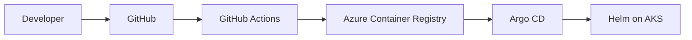

# GitOps Deployment Dashboard

An original intermediate DevOps project that demonstrates automated, observable, and recoverable application delivery on Azure Kubernetes Service.

## Current milestone

Day 1 is complete and the first product slice has started:

- MVP scope and system ownership are documented.
- A responsive dashboard frontend displays health, sync status, release information, workloads, history, and Prometheus-style metrics.
- Sidebar navigation opens dedicated Applications, Deployments, Metrics, Infrastructure, and Settings workspaces.
- Delivery stages, application selection, infrastructure selection, settings switches, sync, and confirmed rollback controls are interactive.
- Sync and rollback controls run as safe UI simulations until the FastAPI integrations are enabled.
- The FastAPI backend includes `/health`, `/ready`, and `/api/applications` development endpoints.
- Initial Docker, GitHub Actions, Terraform, Helm, Argo CD, Prometheus, and Grafana files are scaffolded.
- No Azure resources have been created, so this milestone creates no Azure infrastructure cost.

## Delivery architecture



Argo CD continuously compares Git with AKS. Prometheus scrapes workload metrics, Grafana visualizes them, and the FastAPI service will combine the Argo CD and Prometheus APIs for the custom React dashboard.

## Source-of-truth ownership

| Concern | Owner | Rule |
| --- | --- | --- |
| Azure infrastructure | Terraform | Do not create parallel resources manually in the portal. |
| Tests and container images | GitHub Actions | CI validates code and pushes commit-SHA image tags. |
| Desired application state | Git | Helm values and manifests describe the requested release. |
| Kubernetes reconciliation | Argo CD | CI never deploys with `kubectl`; Argo CD pulls and reconciles. |
| Metrics and alerts | Prometheus / Grafana | Prometheus stores time-series data; Grafana presents it. |
| Operator experience | Dashboard UI + FastAPI | One view for deployments, health, history, sync, rollback, and metrics. |

## Repository map

```text
app/                         Dashboard frontend
backend/                     FastAPI API and tests
.github/workflows/           Frontend and backend CI/image delivery
terraform/                   Azure RG, network, ACR, AKS, and monitoring
helm/gitops-dashboard/       Kubernetes packaging and desired values
argocd/                      AppProject and Application definitions
monitoring/                  ServiceMonitor, alerts, and Grafana dashboard
docs/                        Architecture, Day 1 evidence, and workflow notes
```

## Run the current frontend

```bash
npm ci
npm run dev
```

## Run the development API

```bash
python -m venv .venv
source .venv/bin/activate
pip install -r backend/requirements.txt
PYTHONPATH=backend uvicorn app.main:app --reload --port 8000
```

## Run both containers

```bash
docker compose up --build
```

- Frontend: `http://localhost:3000`
- API health: `http://localhost:8000/health`
- API docs: `http://localhost:8000/docs`

## Before using Azure

1. Confirm the Azure subscription is Enabled in the intended Entra directory.
2. Verify Owner, or Contributor plus User Access Administrator, at subscription scope.
3. Confirm quota and availability for Central India; select a different region if needed.
4. Review the ACR name because it must be globally unique.
5. Approve the cost boundary and cleanup rule before `terraform apply`.

Do not commit credentials. GitHub Actions is designed for Azure OIDC and expects `AZURE_CLIENT_ID`, `AZURE_TENANT_ID`, and `AZURE_SUBSCRIPTION_ID` as GitHub secrets plus `ACR_NAME` and `ACR_LOGIN_SERVER` as repository variables.

## Twenty-day delivery path

| Days | Outcome |
| --- | --- |
| 1-2 | Scope, access, naming, region, and costs approved |
| 3-6 | Frontend and FastAPI work locally |
| 7-8 | Stable local containers and health checks |
| 9-11 | Terraform provisions healthy ACR and AKS resources |
| 12-13 | CI tests and pushes immutable images using OIDC |
| 14-15 | Helm release is healthy on AKS |
| 16 | Argo CD automatic sync, prune, and self-heal work |
| 17-18 | Live Argo CD state and Prometheus metrics appear |
| 19 | Rollback and drift correction are proven |
| 20 | Documentation, evidence, demo, and resource cleanup are complete |

See [docs/architecture.md](docs/architecture.md) and [docs/day-01.md](docs/day-01.md).
