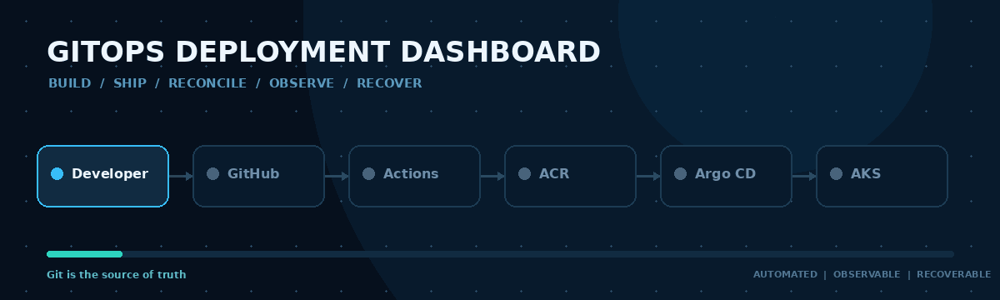
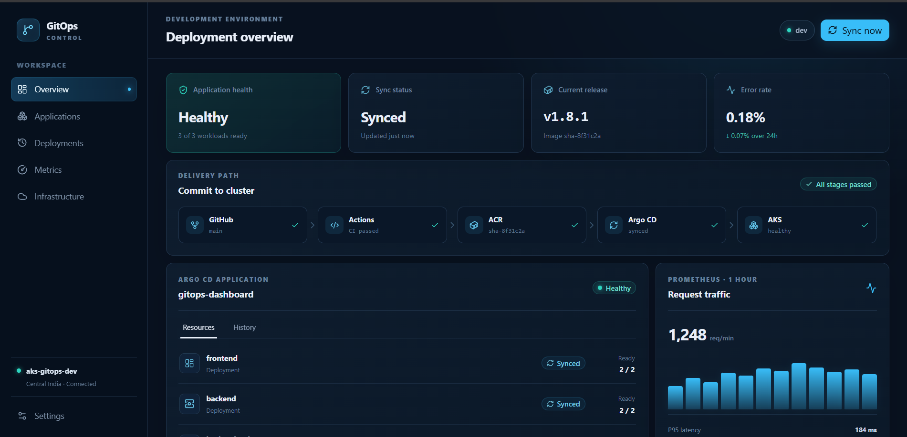
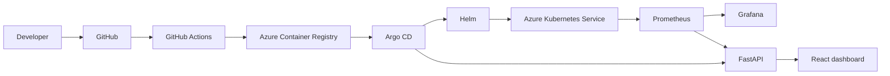

<div align="center">



# GitOps Deployment Dashboard

**An automated, observable and recoverable application-delivery platform built on Azure Kubernetes Service.**

[](#project-status)
[](#project-status)
[](#how-delivery-works)
[](LICENSE)

[Open the live dashboard](https://gitops-deployment-dashboard-chirag.chiragdeviputra33.chatgpt.site) · [Architecture](docs/architecture.md) · [Day 1 evidence](docs/day-01.md)

</div>

---

## Project overview

This original intermediate DevOps project demonstrates the complete path from a Git commit to a healthy Kubernetes release. GitHub Actions validates and packages the application, Azure Container Registry stores immutable images, and Argo CD reconciles Helm configuration into AKS. Prometheus and Grafana provide operational visibility while a custom dashboard presents health, history, metrics, synchronization and rollback controls.

> [!NOTE]
> The current dashboard is an interactive product slice using realistic development data. Live Argo CD and Prometheus API connections are introduced in later project phases.

## Dashboard preview

<div align="center">



</div>

The interface includes working navigation for Overview, Applications, Deployments, Metrics, Infrastructure and Settings. Delivery-stage selection, application selection, settings switches, synchronization and confirmed rollback controls are interactive.

## Architecture



### Source-of-truth ownership

| Concern | Owner | Responsibility |
| --- | --- | --- |
| Azure infrastructure | Terraform | Resource group, network, ACR, AKS and monitoring foundation |
| Continuous integration | GitHub Actions | Test, build and publish commit-SHA container images |
| Desired deployment state | Git and Helm | Record the exact release that should run |
| Kubernetes delivery | Argo CD | Compare Git with AKS and reconcile differences |
| Runtime platform | AKS | Run, scale and health-check application workloads |
| Metrics and alerts | Prometheus and Grafana | Collect, query, visualize and alert on telemetry |
| Operator experience | React and FastAPI | Display status and provide controlled operational actions |

## Core capabilities

- Deploy applications from Git repositories
- Build immutable frontend and backend container images
- Authenticate GitHub Actions to Azure using OIDC
- Automatically synchronize Helm releases through Argo CD
- Detect and correct configuration drift
- Display application and Kubernetes health
- Preserve deployment history and commit traceability
- Perform confirmed rollback operations
- Monitor request rate, errors, latency, CPU and memory
- Recreate Azure infrastructure using modular Terraform

## Technology stack

<div align="center">


</div>

## How delivery works

1. A developer opens a pull request or pushes a commit to GitHub.
2. GitHub Actions tests the React frontend and FastAPI backend.
3. After a merge to `main`, CI authenticates to Azure through OIDC.
4. CI builds two Docker images and tags them with the Git commit SHA.
5. The images are pushed to Azure Container Registry.
6. A reviewed Git change selects the new image tag in the Helm values.
7. Argo CD detects the desired-state change and renders the Helm chart.
8. AKS performs a rolling update while readiness and liveness probes protect traffic.
9. Argo CD reports synchronization and health, and self-heals unauthorized drift.
10. Prometheus collects metrics; Grafana and the custom dashboard present operational status.

### Recovery rule

A Git revert is the preferred rollback because Git remains the authoritative audit trail. A direct Helm rollback may be used during an emergency, but the matching desired state must also be corrected in Git or Argo CD will reconcile it again.

## Repository structure

```text
.
├── .github/workflows/          # Frontend and backend CI/image delivery
├── app/                        # Interactive React dashboard
├── backend/                    # FastAPI service and tests
├── terraform/                  # Modular Azure infrastructure
│   └── modules/                # Network, ACR, AKS and monitoring modules
├── helm/gitops-dashboard/      # Kubernetes application chart
├── argocd/                     # AppProject and Application definitions
├── monitoring/                 # ServiceMonitor, alerts and Grafana dashboard
├── docs/                       # Architecture, evidence and visual assets
├── Dockerfile                  # Frontend container image
└── docker-compose.yml          # Local frontend/backend environment
```

## Run locally

### Prerequisites

- Node.js 22 or later
- Python 3.13 or later
- Docker with Docker Compose

### Dashboard frontend

```bash
npm ci
npm run dev
```

Open `http://localhost:3000`.

### FastAPI backend

```bash
python -m venv .venv
source .venv/bin/activate
pip install -r backend/requirements.txt
PYTHONPATH=backend uvicorn app.main:app --reload --port 8000
```

- Health endpoint: `http://localhost:8000/health`
- Readiness endpoint: `http://localhost:8000/ready`
- Swagger documentation: `http://localhost:8000/docs`

### Both services with Docker

```bash
docker compose up --build
```

## GitHub Actions configuration

The workflows are designed for passwordless Azure OIDC authentication.

### Repository secrets

| Secret | Purpose |
| --- | --- |
| `AZURE_CLIENT_ID` | Client ID of the federated Azure identity |
| `AZURE_TENANT_ID` | Microsoft Entra tenant ID |
| `AZURE_SUBSCRIPTION_ID` | Target Azure subscription ID |

### Repository variables

| Variable | Purpose |
| --- | --- |
| `ACR_NAME` | Azure Container Registry resource name |
| `ACR_LOGIN_SERVER` | Registry hostname used in image tags |

Never commit tokens, passwords, service-principal secrets, kubeconfig files or Terraform state.

## Project status

| Area | Status |
| --- | --- |
| Product scope and architecture | Complete |
| Interactive dashboard foundation | Complete |
| FastAPI development endpoints | Complete |
| Docker, CI, Terraform, Helm and Argo CD scaffolding | Complete |
| Azure access and cost approval | Pending |
| Live ACR and AKS infrastructure | Pending |
| Live Argo CD integration | Pending |
| Live Prometheus and Grafana integration | Pending |
| Recovery and drift demonstration | Pending |

No chargeable Azure resources have been created at this stage.

## Twenty-day execution roadmap

| Days | Delivery gate |
| --- | --- |
| 1-2 | Scope, access, naming, region and cost boundary approved |
| 3-6 | React dashboard and FastAPI work locally |
| 7-8 | Both services run as stable, health-checked containers |
| 9-11 | Terraform provisions healthy ACR and AKS resources |
| 12-13 | CI tests and pushes immutable images using OIDC |
| 14-15 | Helm release is healthy on AKS |
| 16 | Argo CD auto-sync, pruning and self-healing work |
| 17-18 | Live Argo CD data and Prometheus metrics are visible |
| 19 | Rollback and drift correction are demonstrated |
| 20 | Documentation, evidence, demo and resource cleanup are complete |

## Security principles

- Prefer workload identity and short-lived tokens over stored passwords.
- Disable ACR administrative credentials.
- Give CI permission to push images without AKS administrator access.
- Keep Argo CD and Prometheus APIs private or authenticated.
- Route synchronization and rollback through validated backend actions.
- Treat manual cluster modifications as drift.
- Review Terraform plans before creating chargeable resources.

## Documentation

- [Architecture and workflow](docs/architecture.md)
- [Day 1 decisions and evidence](docs/day-01.md)
- [Terraform configuration](terraform/)
- [Helm chart](helm/gitops-dashboard/)
- [Argo CD definitions](argocd/)
- [Monitoring resources](monitoring/)

---

<div align="center">

Built from scratch by **Chirag Deviputra** as an Azure DevOps and GitOps portfolio project.

</div>
